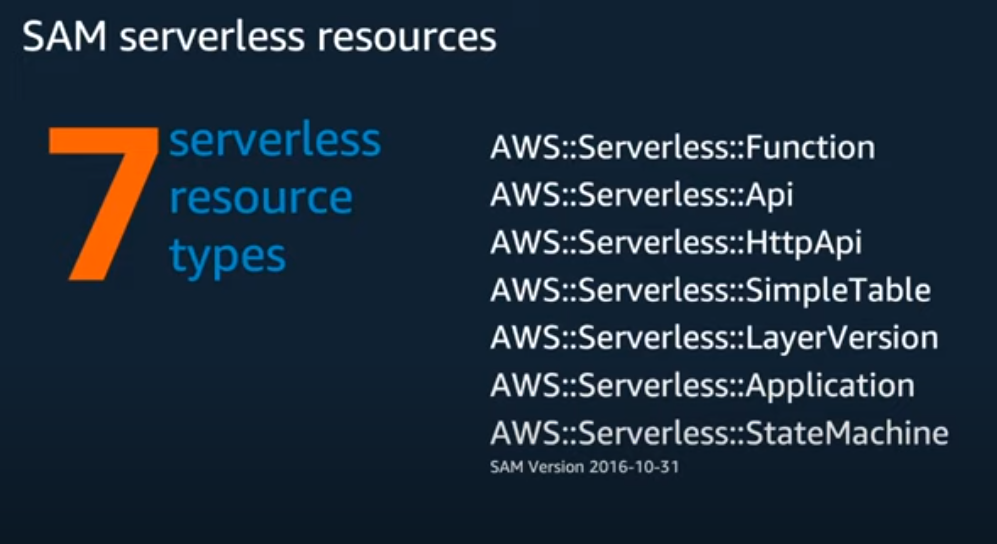
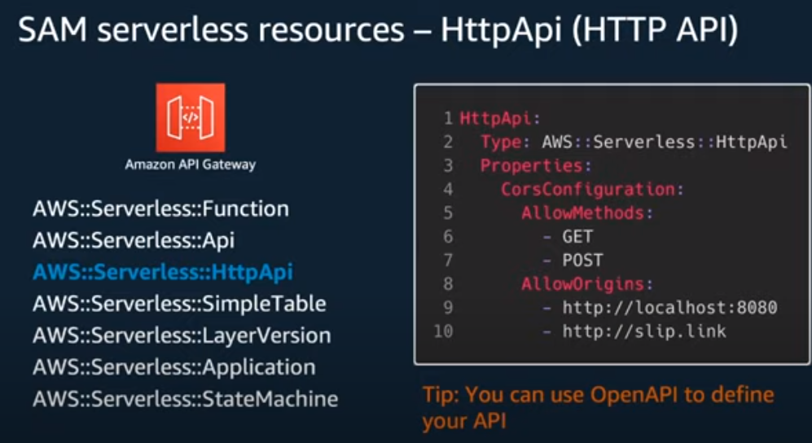
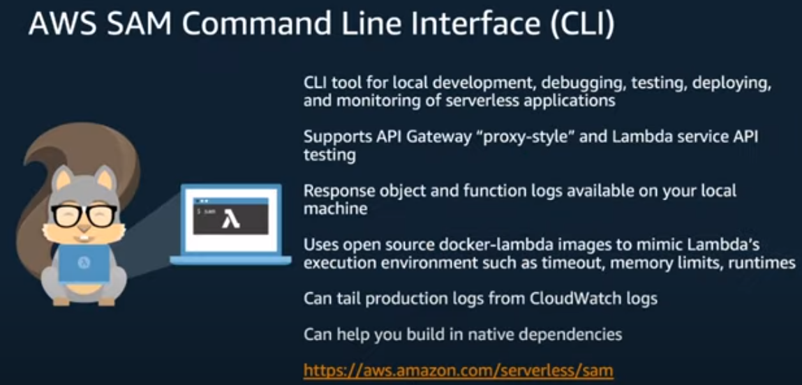
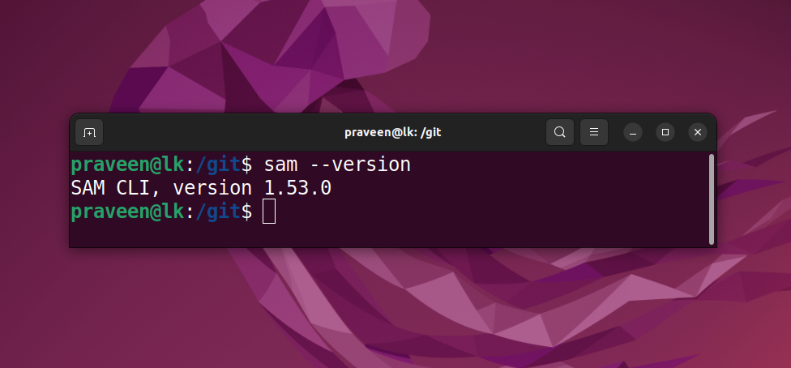
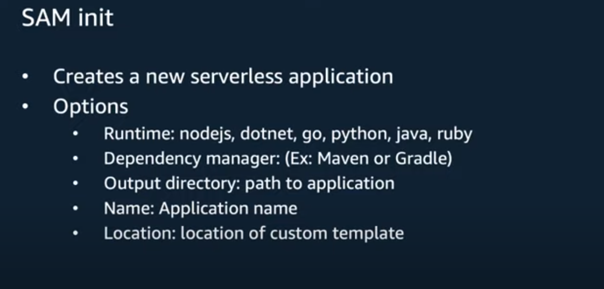
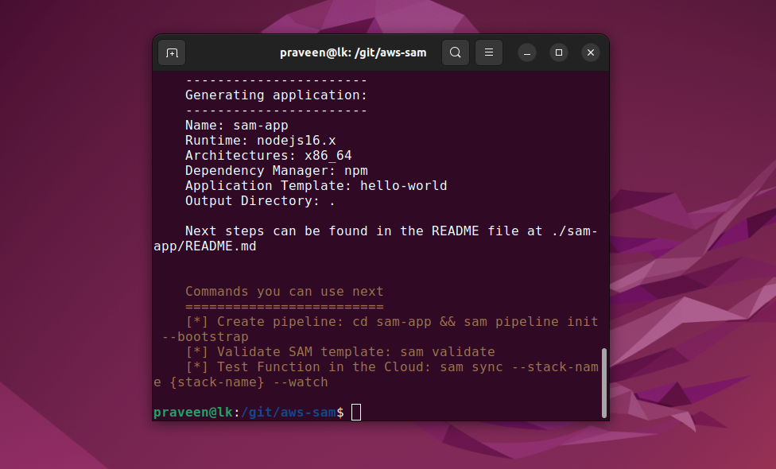
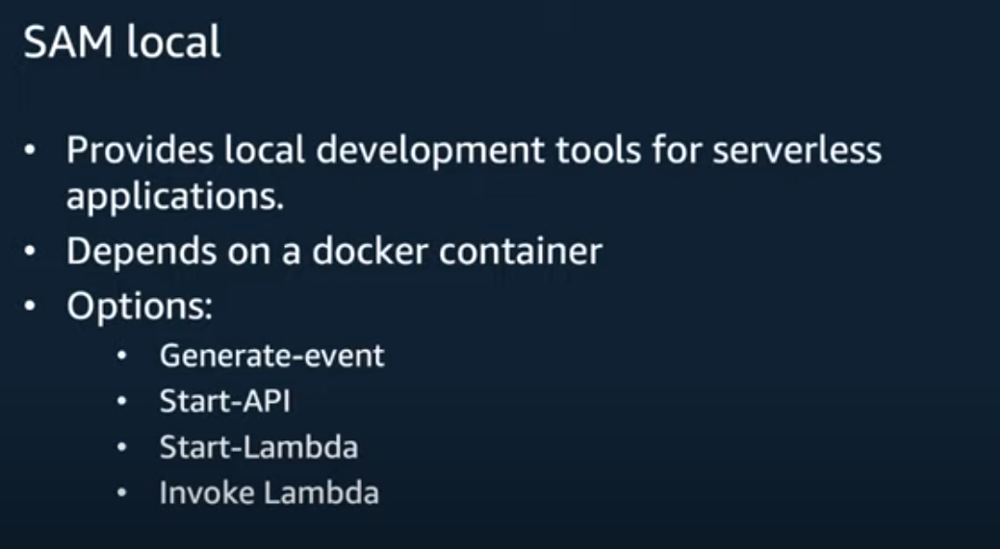
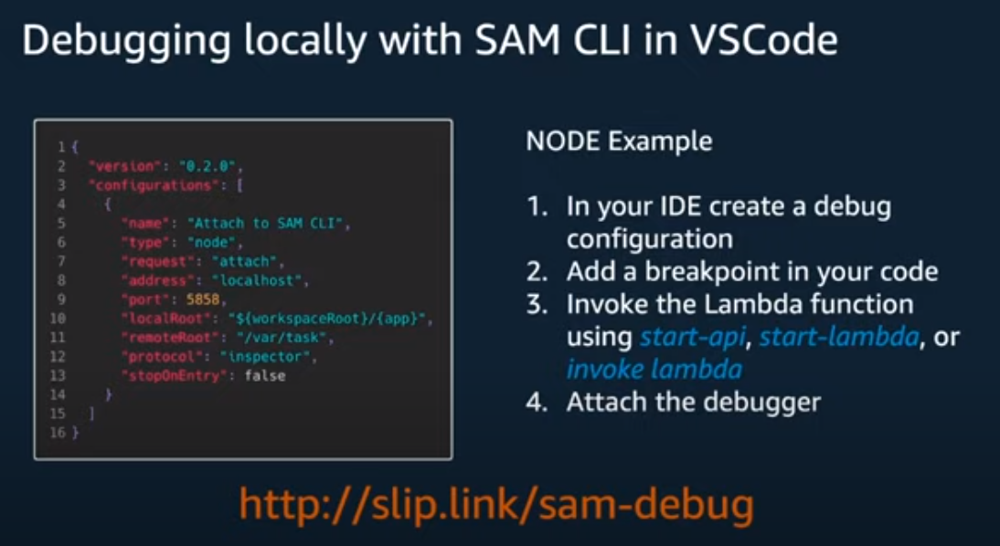

# Meet SAM

## SAM the Squirrel

## SAM left behind a cozy life in the trees to help AWS users build their serverless applications effectively and more easily

AWS SAM: AWS (S)erverless (A)pplication (M)odel 

# SAM Templates

# 7 Serverless Resource Types

# HTTP API

# SAM CLI

# SAM Init

# SAM Local

# SAM Debug

